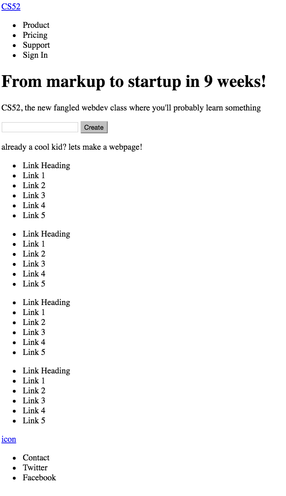
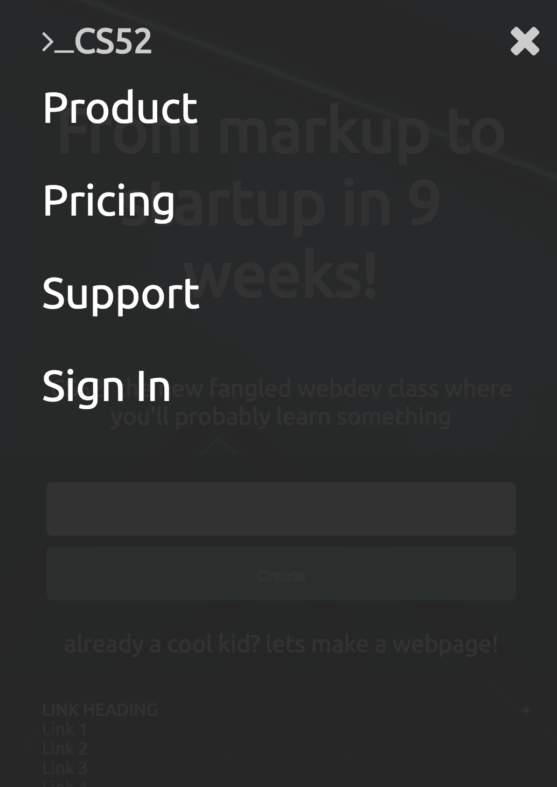

# Robert Sayegh's CS52 - HW1
I followed the intructions in the assignment for CS52, HW1, creating a static landing page according to the directions at http://cs52.me/assignments/hw1/. I used classes as ot avoid all inline styles, reuing CSS classes where possible throughout the page. All of the major layout on the page was done in flexboxes.

Additionally, I imlemented drop down menus in the bottom of the mobile page for the links section, and a dropdown menu for the mobile menu with CSS transitions for opening and closing. This was accomplished using the well-documented checkbox hack on the adjacent elements to a hidden checkbox on the page.

I learned a lot doing this assignment, even though I have done a fair amount of webdev in the past. I had never used flexboxes before, nor had I heard of them, but am now quite comfortable with them and will continue to use them as I do WebDev. Additionally, I was a big fan of inline style overrides in the past, but looked toward classes for this assignment and will never turn back.

The main problem I ran into was with some elements the mobile site overflowing the width of the page when set to `width: 100%`. It happened on two occassions, for two different reasons. The first was an issue of padding, the second was an extraneous property for a flexbox container that I had added while adjusting the desktop version of the site, where it had seemingly now effect. Both were easily remedied once the problem was isolated, but it was very time consuming to isolate the problem.

Features anf screenshots below.

**Screenshot of the initial layout:**

**Screenshot of the dropdown links:**

Pre click:

Post click:

**Screenshot of the dropdown menu:**
